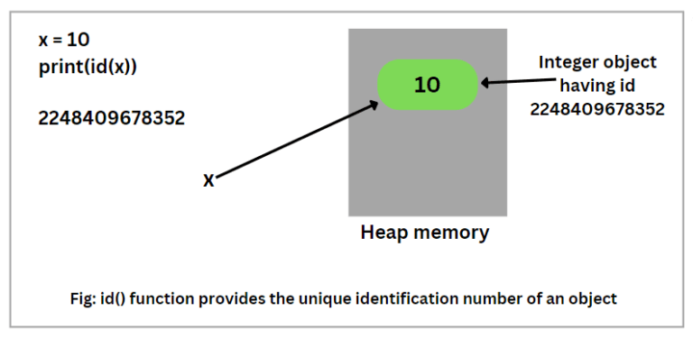
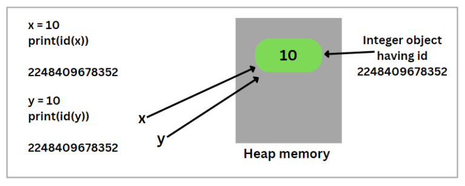
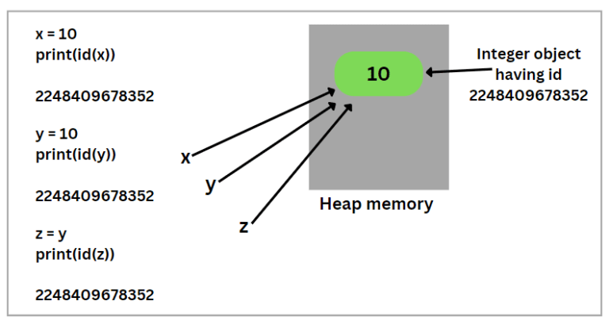
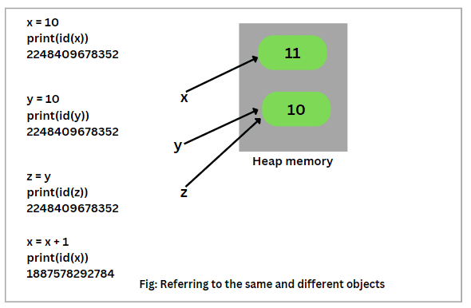
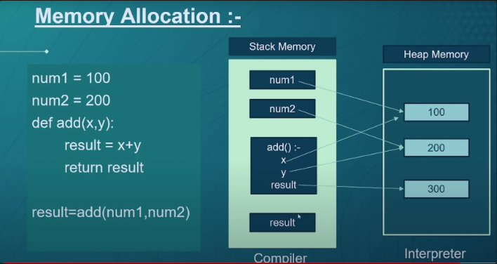

### How does Python Manage Memory?

Memory management in Python is the process by which the computer system reserves a part or complete section of memory for the process and execution of programs. It allows the application programs to read and write data. We know that there is an enormous size of memory in the computer system.


In python memory management is totally automatic.

- they are mainly two scripts for memory management in Python:

     1.  python memory manager:- memory allocation

     2. python garbage collector:-deallocation of memory


First we know how about Reference Counting

#### Referencce counting

Each object in Python has a reference count which tracks how many references point to the object. When this count drops to zero, the memory is freed. Each object has an internal counter.


 Suppose we assign a value of 10 to a variable x:

```
x = 10
```
Here, 10 is an integer object in memory and “x” is a reference variable pointing to this integer object. Look at the below example code.

```
x = 10
print(id(x))
```
Output: 
```
      2248409678352
```

In this example, the id() function generates a unique identification number for an object. This unique identification number is an integer value which will remain unique and constant for the Python object during its lifespan, as shown in the below figure. The id for integer object 10 is 2248409678352.



Two objects with non-overlapping lifetimes can have the identical id value. Let’s understand it with an example. Suppose we assign the same value 10 to a new variable y. Look at the following code snippet.

```
x = 10
print(id(x))
y = 10
print(id(y))
```


Output:

```
      2070047162896
      2070047162896
```

As you can observe in the output, both reference variables x and y are pointing to the same integer object 10 because of the same unique identification number. Look at the below figure that x and y have reference to the same object.



Now, consider the following example code below.
```
x = 10
print(id(x))

y = 10
print(id(y))

z = y
print(id(z))
```

Output:
```
      2070047162896
      2070047162896
      2070047162896
```

As you can see in the output, the id() function generated the same identification number for the integer object 10. Therefore, z is also pointing to the same object.




Now, suppose we are performing the following operation in the above code.

```
x = 10
print(id(x))
y = 10
print(id(y))

z = y
print(id(z))
x = x + 1
print(id(x))
```

Output:
```
      1887578292752
      1887578292752
      1887578292752
      1887578292784
```

Now, as you can see in the output, the id() function has generated the different identification number for this operation x = x + 1. Therefore, x is not equal to 11 and now refers to the different integer object 11.





Code:

Python keeps a count of references to each object in memory. When this count drops to zero, the memory is freed. Each object has an internal counter.

```
import sys
sys.getrefcount(2)
```

output:
```
4294967295
```
But i didn't use any where even though it gives me the refernce count of 4294967295 how is it possible.


in Python’s memory management system. The sys.getrefcount function returns the reference count for an object, and for immutable objects like integers, it can lead to some quirky results due to optimizations Python performs.

Python keeps a pool of small integers (usually between -5 and 256) which are reused, hence a higher refcount. If you're seeing a number like 4294967295, it’s likely an overflow or anomaly, especially given that’s the maximum value for a 32-bit unsigned integer.

For a deeper dive, you might want to look into CPython's memory management and the implementation details of the integer object.


### Types of Memory


#### Stack Memory (stack Space)
Stack memory is used for static memory allocation. This includes all the local variables and function calls. It's fast and managed automatically with the Last-In-First-Out (LIFO) method.
stack memory : managed  and allocated by  compiler

- static memory
- slow compared to heap
- can access directly
- stack memory used to store references ,names, function calls
- At compile time memory will be allocated to reference


#### Heap Memory (Heap space)

Heap memory is used for dynamic memory allocation. This is where the actual objects (like lists, dictionaries, etc.) live. The Python memory manager handles the allocation and deallocation of heap memory automatically.

heap memory:- managed and allocated by interpreter 

- Dynamic memory
- faster compared to stack
- can’t access directly ,we can access them by using references
- heap used to store all values and objects
- At run time memory will be allocated to actual values and objects


Example:




### Garbage Collection

Python's gc module provides an interface to the garbage collector for debugging and manual collection.

```
import gc

gc.collect()  # Trigger a manual garbage collection cycle
print(gc.garbage)  # List of objects that the collector found to be unreachable but couldn't free
```


Python also uses a garbage collector to handle cycles—situations where two or more objects reference each other but are no longer referenced elsewhere.

Example:

```
import gc

class Node:
    def __init__(self, value):
        self.value = value
        self.ref = None

a = Node(1)
b = Node(2)
a.ref = b
b.ref = a
del a
del b

# At this point, `a` and `b` are part of a cycle and won't be collected by reference counting
gc.collect()  # Manually run the garbage collector to clean up
```

### Memory Pooling
Python preallocates memory for small objects (like integers and strings) to improve performance and reduce fragmentation. These objects are stored in pools and reused when possible.

Example:

```
a = 42
b = 42  # 'a' and 'b' reference the same object
print(id(a) == id(b))  # True
```

### PyObject Structure
Every object in Python is represented by a PyObject structure. This structure includes:

- A reference count

- A pointer to the type object describing the object's type

Other object-specific data

Example:

```
typedef struct _object {
    _PyObject_HEAD_EXTRA
    Py_ssize_t ob_refcnt;
    struct _typeobject *ob_type;
} PyObject;
```


