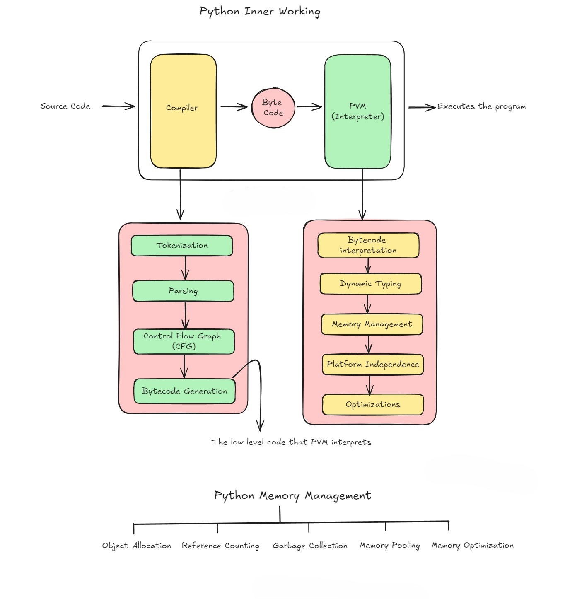

# Internal Working Of Python

 **Source Code** : When you write a Python script, it’s human-readable text. This source code is the starting point for everything.

 **2. Compiler** : Python uses an interpreter, but it first compiles your source code into a lower-level form known as bytecode.

* **Tokenizing** : Breaks down your code into small pieces called tokens (like keywords, operators, identifiers).
* **Parsing** : Analyzes the tokens to ensure they follow Python's syntax rules.
* **Control Flow Graph (CFG)** : Represents all paths that might be traversed through a program during its execution.
* **Bytecode Generation** : Converts the parsed tokens into bytecode, a set of instructions for the Python Virtual Machine (PVM).

Let’s deep dive this

 **Python Compiler** : Even though Python is known as an interpreted language, it does have a compilation step. Here’s the breakdown:

### **Tokenization** :

Breaks down your code into small pieces called tokens (like keywords, operators, identifiers).

1. **Source Code** : Starts with your written code.
2. **Tokenizer (Lexer)** : This breaks the source code into smaller pieces called tokens, like keywords (`for`, `if`), operators (`+`, ``), identifiers (variable names), and literals (like numbers or strings).

### **Parsing** :

Analyzes the tokens to ensure they follow Python's syntax rules.

1. **Syntax Analysis** : The parser takes these tokens and checks them against Python's grammar rules.
2. **Parse Tree** : Builds a tree structure from the tokens, representing the grammatical structure of the code.
3. **Semantic Analysis** : Ensures the code makes sense in terms of data types, scope, and other context-specific rules.

### **Control Flow Graph (CFG)** :

Represents all paths that might be traversed through a program during its execution.

1. **Control Flow Graph** : Represents all possible paths that might be taken through the code during execution.
2. **Nodes and Edges** : Each node represents a basic block of code, and edges represent the flow of control from one block to another.

### **Bytecode Generation** :

Converts the parsed tokens into bytecode, a set of instructions for the Python Virtual Machine (PVM).

1. **Bytecode** : The parsed code is converted into bytecode, a lower-level, platform-independent representation.
2. **Instruction Set** : This bytecode is a set of instructions that the Python Virtual Machine (PVM) can execute. Bytecode is stored in `.pyc` files in the `__pycache__` directory to speed up future executions.

 **Execution** :

1. **Python Virtual Machine (PVM)** : The bytecode is then executed by the PVM, interpreting the instructions to perform the program’s tasks.

To recap, Python first compiles your code into bytecode before interpreting it. This hybrid approach allows Python to be flexible and platform-independent while still achieving reasonable performance.

 **3. Byte Code** : The bytecode is a more compact, lower-level representation of your source code, optimized for execution. It’s platform-independent, meaning it can be run on any system with a compatible PVM.

 **4. Python Virtual Machine (PVM)** : The PVM takes the bytecode and executes it.

* **Dynamic Typing** : Python determines the data type of an object at runtime.
* **Memory Management** : Manages allocation and deallocation of memory for variables and objects.
* **Platform Independence** : Bytecode can be run on any platform with a compatible PVM.
* **Optimizations** : PVM includes various runtime optimizations to improve performance.

 **Memory Management in Python** :

1. **Object Allocation** : Python objects (like integers, strings, lists) are created in memory when the code is run.
2. **Reference Counting** : Python keeps track of how many references there are to an object in memory. When the reference count drops to zero, the memory occupied by the object can be reclaimed.
3. **Garbage Collection** : Python has a garbage collector that helps manage memory by deallocating memory that is no longer in use (i.e., objects with a reference count of zero).
4. **Memory Pooling** : Python uses pools of memory to allocate small objects more efficiently. This pooling helps reduce the overhead of frequently allocating and deallocating small chunks of memory.
5. **Memory Optimization** : Python applies various optimizations to minimize memory usage, such as:

* Reusing small integers and interned strings.
* Efficiently managing data structures (e.g., tuples, lists, dictionaries).
