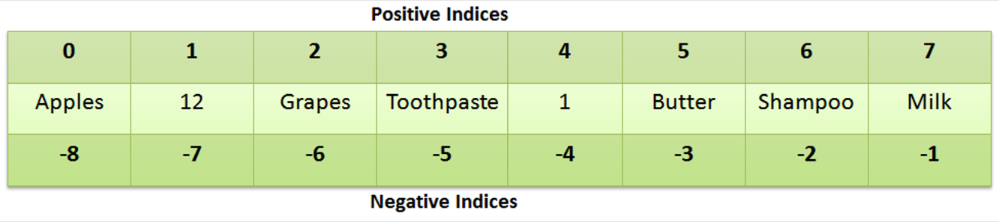
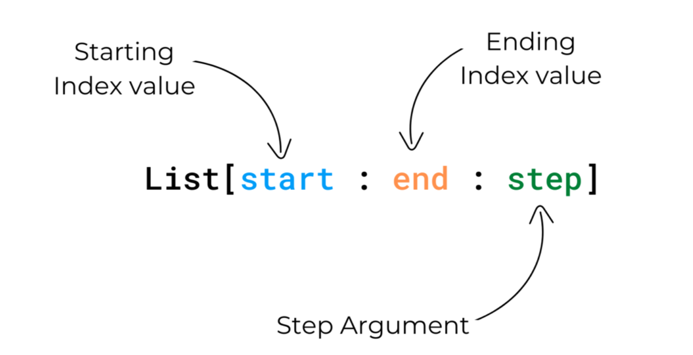
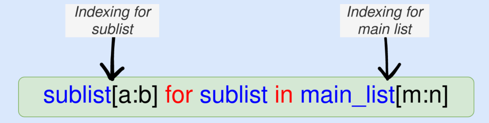
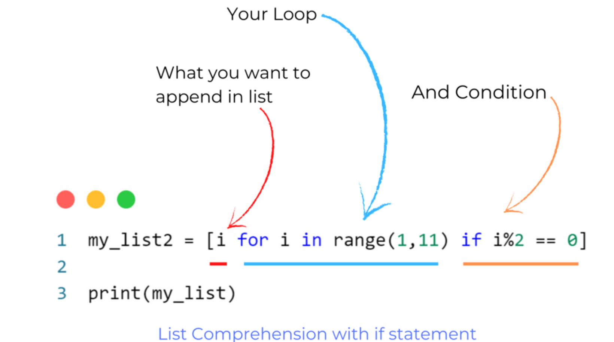
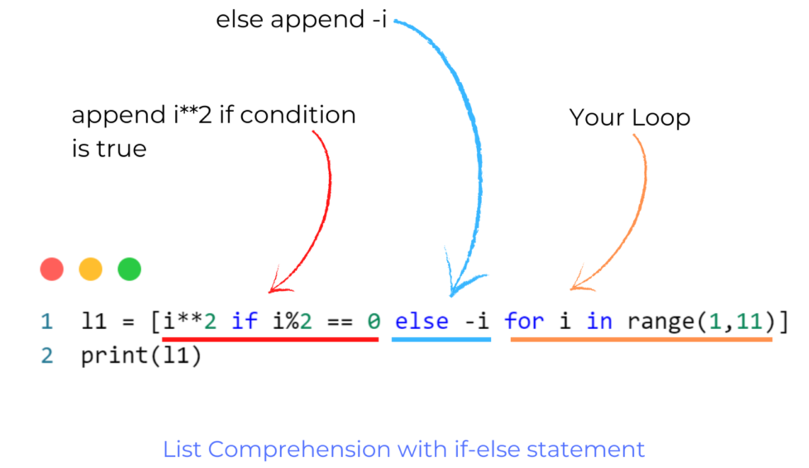

### **Lists:**

- Lists are ordered collections of items.
- Elements can be of different types.
- Lists are **mutable** (can be modified).

```python

my_list = [1, 'apple', 3.14, [4, 5]]

```

A list in Python is an ordered collection of items or elements. It is one of the most commonly used data structures in Python and is versatile because it can store elements of different data types. Lists are mutable, meaning you can change, add, or remove elements after creating the list.

Here's an overview of how to work with lists in Python:

# 1. **Creating Lists:**

- **To create a list in Python write comma-separated values inside a square bracket ([ ]) or you can use the `list()` function to create a list in Python.**
- Lists can be empty or contain elements of any data type.

```python

my_list = [1, 2, 3, 'apple', 'banana']
empty_list = []

```

## Create a list using list() function

**Example:**

```python
num_list = list(range(1,11))
print(num_list)
```

**Output:**

```markup
[1, 2, 3, 4, 5, 6, 7, 8, 9, 10]
```

## Mixed list

You can store anything in a list (like int, float, string, boolean, tuples, list, dictionary, etc..,)

**Example:**

```python
mixed_list = ["first name",34.5,45,True]
print(mixed_list)
```

**Output:**

```markup
['first name', 34.5, 45, True]
```

## Create empty list

There are two ways to create an empty list in python.

1. using square bracket
2. using **`list()`** function

**Example:**

```python
# using square breaket
my_list1 = []
# using list function
my_list2 = list()

print(my_list1) # []
print(my_list2) # []
```

**Output:**

```markup
[]
[]
```

# Add data to  list

There are three methods used to add data to the list and they are.

1. append()
2. insert()
3. extend()

### 1. append() method

**append() method is used to add data at the end of the list.**

*Syntax –>*

```python
list_name.append(data)
```

**Example:**

```python
my_num1 = [1,2,3]
print(my_num1)

my_num1.append(4)  # add 4
print(my_num1)

my_num1.append(45) #add 45
print(my_num1)
```

**Output:**

```markup
[1, 2, 3]
[1, 2, 3, 4]
[1, 2, 3, 4, 45]
```

### 2. insert() method

**insert() method is used to add data at a specific index in the list.**

*Syntax –>* 

```python
list_name.insert(index_value, data)
```

**Example:**

```python
my_data = ['harshit','rahul','raj']
print(my_data)

my_data.insert(1,'saurabh')
print(my_data)

my_data.insert(0,'python')
print(my_data)
```

**Output:**

```markup
['harshit', 'rahul', 'raj']
['harshit', 'saurabh', 'rahul', 'raj']
['python', 'harshit', 'saurabh', 'rahul', 'raj']
```

### 3. extend() method

**extend() method is used to add the whole data of the list into another list.**

*syntax –>* 

```python
list_name_1.extend(list_name_2)
```

**Example:**

```python
my_data1 = ['A','B','C','D']
my_data2 = ['E','F','G','H']

my_data1.extend(my_data2)

print(my_data1)
```

**Output:**

```markup
['A', 'B', 'C', 'D', 'E', 'F', 'G', 'H']
```

# Delete data from list

there are two methods and one operator (keyword) use to delete data from the list and they are.

1. pop() method
2. remove() method
3. del keyword

### 1. pop() method

**pop() method is used to remove data at the end of the list.**

*Syntax –>* 

```python
list_name.pop()
```

**Example:**

```python
my_data1 = ['A','B','C','D']
print(my_data1)

my_data1.pop()
print(my_data1)

my_data1.pop()
print(my_data1)
```

**Output:**

```markup
['A', 'B', 'C', 'D']
['A', 'B', 'C']
['A', 'B']
```

**NOTE:** In the pop method if you write the index value of data then the pop method will delete data at that particular index.

**example:** 

```python
mydata1.pop(0) {remove data at index 0}
```

### 2. remove() method

**remove method is used to remove specific data from the list.**

*Syntax –>* 

```python
list_name.remove(your_data)
```

**Example:**

```python
my_list = ['harshit','rahul','raj']
print(my_list)

my_list.remove('raj')
print(my_list)
```

**Output:**

```markup
['harshit', 'rahul', 'raj']
['harshit', 'rahul']
```

### 3. del keyword

**del keyword is used to delete data at a specific index in a list and the del keyword is also used to delete the whole list.**

*Syntax –>* 

```python
**del** list_name[index_value]
```

**Example:**

```python
my_data2 = ['E','F','G','H']
print(my_data2)

del my_data2[1] #remove F
print(my_data2)
```

**Output:**

```markup
['E', 'F', 'G', 'H']
['E', 'G', 'H']
```

# Loop in list

**for loop:**

```python
fruits = ['orange', 'apple', 'pear']

for i in fruits:
    print(i)
```

**Output:**

```markup
orange
apple
pear
```

example 2:

Another way of printing the items of list .here student is not a  int type so in order to iterate we need to find the length of the list so we len and range function

 

```python
students=['Appu','fil','zill']

for i in range(len(students)):
    print(students[i])
```

```python
Appu
fil
zill
```

```python
students=['Appu','fil','zill']

for i in range(len(students)):
    print(i,students[i])

```

```python
0 Appu
1 fil
2 zill
```

to print the start number 1 we need to add the number.

```python
students=['Appu','fil','zill']

for i in range(len(students)):
    print(i+1,students[i])
```

```python
1 Appu
2 fil
3 zill
```

**while loop:**

```python
fruits = ['orange', 'apple', 'pear']

i = 0
while i < len(fruits):
    print(fruits[i])
    i+=1
```

**Output:**

```markup
orange
apple
pear
```

```python
fruits=['apple', 'orange','mangaos','malberry']

i=0
while i<len(fruits):
    print(i+1,fruits[i])
    i+=1

```

```python
1 apple
2 orange
3 mangaos
4 malberry
```

## List inside list

```python
matrix  = [[1,2,3],[4,5,6],[7,8,9]]
print('list inside list: ',matrix)  # this type of list is known as 2d list

print('list elments: ',matrix[0])
print('elements of list inside list: ',matrix[0][1])

print('loop in 2d list')

for i in matrix:
    for j in i:
        print(j)
```

**Output:**

```markup
list inside list:  [[1, 2, 3], [4, 5, 6], [7, 8, 9]]
list elments:  [1, 2, 3]
elements of list inside list:  2
loop in 2d list
1
2
3
4
5
6
7
8
9
```

## Methods of list

| 1. count() | 2. sort() | 3.index() |
| --- | --- | --- |
| 4. reverse() | 5. clear() | 6. copy() |
| 7. append() | 8. insert() | 9. extend() |
| 10. pop() | 11. remove() | 12. len() function |

### Count() Method

**the count() method returns the number of times specified items appear in a list.**

```python
cars = ['Toyota','Chevrolet','Renault','Toyota']

print(cars.count('Toyota'))
```

**Output:**

```markup
2
```

### sort() Method

**The sort() method sorts the list in ascending, descending, or alphabetical order.**

```python
# ascending order

numbers = [5,2,7,1,3]
numbers.sort()
print(numbers)   # output: [1, 2, 3, 5, 7]

alphabates = ['A','F','B','K','D']
alphabates.sort()
print(alphabates)  #output: ['A', 'B', 'D', 'F', 'K']

# descending order

num2 = [1,5,2,6,8]
num2.sort(reverse=True)
print(num2)  # output: [8, 6, 5, 2, 1]

alphabates2 = ['A','F','B','K','D']
alphabates2.sort(reverse=True)
print(alphabates2) # output: ['K', 'F', 'D', 'B', 'A']

```

**Output:**

```markup
[1, 2, 3, 5, 7]
['A', 'B', 'D', 'F', 'K']
[8, 6, 5, 2, 1]
['K', 'F', 'D', 'B', 'A']
```

### Sorted() Function

You can also use **`sorted()`** function to sort the list.

**The main difference between the sort() method and the sorted() function is that the sorted() function returns a new sorted list but the sort() method sorts in the same list.**

```python
# ascending order
numbers = [5,2,7,1,3]
rev_num = sorted(numbers)
print(rev_num)

# descending order
num2 = [1,8,5,9,3]
rev_num2 = sorted(num2,reverse=True)
print(rev_num2)
```

**Output:**

```markup
[1, 2, 3, 5, 7]
[9, 8, 5, 3, 1]
```

### index() Method

**The index() method returns the index value of the first occurs specified item of the list.**

```python
bikes = ['Suzuki','TVS','Hero','Suzuki']
print(bikes.index('Suzuki'))
```

**Output:**

```markup
0
```

### reverse() Method

**the reverse() method is used to reverse the list.**

```python
bikes = ['Suzuki','TVS','Hero','Yamaha']
bikes.reverse()
print(bikes)
```

**Output:**

```markup
['Yamaha', 'Hero', 'TVS', 'Suzuki']
```

### clear() Method

**The clear() method is used to clear (or empty) the list.**

```python
num = [1,2,3,4,5]
num.clear()
print(num)
```

**Output:**

```markup
[]
```

### copy() Method

the copy() method is used to create a copy of the list.

```python
l1 = [2,3,5,7,11,13]
l2 = l1.copy()

print(l2)
```

**Output:**

```markup
[2, 3, 5, 7, 11, 13]
```

1. **Accessing Elements:**
    - You can access elements of a list using indexing.
    - Indexing starts at 0 for the first element, and negative indices count from the end of the list.
    
    ```python
    
    first_element = my_list[0]  # Access the first element
    last_element = my_list[-1]  # Access the last element
    
    ```
    
2. **Slicing Lists:**
    - Slicing allows you to extract a portion of a list by specifying a start and end index.
    - Slicing returns a new list containing the selected elements.

    
    
  
    ```python
    
    sliced_list = my_list[1:4]  # Extract elements from index 1 to 3 (inclusive)
    
    ```
    
    ## Slicing
    
    Slicing is a powerful method that allows us to extract a specific range of elements from a list or a string. We can use the colon (:) operator to slice a list or a string.
    
    Syntax for Slicing: **`list[start:end:step]`**
    
    
    
    Here, 
    
    **`start`** is the index of the first element that we want to include in the slice.
    
    **`end`** is the index of the element that we want to exclude from the slice.
    
     **`step`** is the number of indices we want to skip between the elements of the slice.
    
    If we omit the **`start`** and **`end`** indices, the slice will include all the elements of the list or the string.
    
    For example, consider the following list of fruits:
    
    ```python
    fruits = ['apple', 'banana', 'cherry', 'mango', 'orange']
    
    # Extract the first three elements of the list
    print(fruits[0:3])  # Output: ['apple', 'banana', 'cherry']
    
    # Extract the last three elements of the list
    print(fruits[-3:])  # Output: ['cherry', 'mango', 'orange']
    
    # Extract all the elements of the list except the first and the last element
    print(fruits[1:-1])  # Output: ['banana', 'cherry', 'mango']
    
    # Extract all the elements of the list in reverse order
    print(fruits[::-1])  # Output: ['orange', 'mango', 'cherry', 'banana', 'apple']
    ```
    
    ## Step Argument
    
    **The step argument is an optional parameter that allows us to skip elements while slicing.**
    
    **It is denoted by using a third index separated by a colon** (**`list[start:end:step]`**).
    
    **For example:**
    
    ```python
    # Select every other element of the list
    my_list = [0, 1, 2, 3, 4, 5]
    sub_list = my_list[::2]
    print(sub_list)  # Output: [0, 2, 4]
    
    ```
    
    **You can also use negative values for the step argument to reverse the order of the slice.**
    
    **For example:**
    
    ```python
    # Reverse the order of the list
    my_list = [0, 1, 2, 3, 4, 5]
    sub_list = my_list[::-1]
    print(sub_list)  # Output: [5, 4, 3, 2, 1, 0]
    ```
    
3. **Modifying Lists:**
    - Lists are mutable, so you can change their elements.
    - You can assign new values to elements, append elements, insert elements, and remove elements.
    
    ```python
    
    my_list[2] = 'cherry'  # Change the value of an element
    my_list.append('orange')  # Add an element to the end
    my_list.insert(1, 'pear')  # Insert an element at a specific index
    my_list.remove('banana')  # Remove a specific element
    
    ```
    
4. **List Methods:**
    - Python provides several built-in list methods for various operations, including sorting, counting, and more.
    
    ```python
    
    my_list.sort()  # Sort the list in ascending order
    count = my_list.count('apple')  # Count occurrences of an element
    
    ```
    
5. **List Length:**
    - You can find the length (number of elements) of a list using the **`len()`** function.
    
    ```python
    
    length = len(my_list)  # Get the number of elements in the list
    
    ```
    
6. **List Comprehensions:**
    - List comprehensions provide a concise way to create lists based on existing lists or other iterables.
    
    ```python
    
    squares = [x ** 2 for x in range(1, 6)]  # Create a list of squares
    
    ```
    
    # Using List Comprehension
    
    This approach allows us to slice the main list and the sublists **even if the sublists are not of the same length.**
    
    The general syntax for list comprehension for slicing is given in the Figure below.
    

    
    Here are some examples in code.
    
    ```python
    # A list within a list - the main list
    lst1 = [["Sam", 96, "Warsaw", None], ["Belinda", 78, "Israel", "GT"], ["Sally", 56, "SA", "SL"], ["Smith", 77, "Poland", "SZ"]]

    # Get the second and third elements of each sublist for the third sublist to the end
    lst2 = [sublist[1:3] for sublist in lst1[2:]]
    print("lst2: ", lst2)

    # Get the first three elements of each sublist for all sublists in the main list
    lst3 = [sublist[:3] for sublist in lst1]
    print("lst3: ", lst3)

    # Get the last two elements of the sublists for the first three sublists.
    lst4 = [sublist[-2:] for sublist in lst1[:3]]
    print("lst4: ", lst4)
    ```
    
    **Output:**
    
    ```
    lst2:  [[56, 'SA'], [77, 'Poland']]
    lst3:  [['Sam', 96, 'Warsaw'], ['Belinda', 78, 'Israel'], ['Sally', 56, 'SA'], ['Smith', 77, 'Poland']]
    lst4:  [['Warsaw', None], ['Israel', 'GT'], ['SA', 'SL']]
    ```
    

Lists are a fundamental data structure in Python, and they are widely used for tasks like storing collections of data, managing data records, and implementing various algorithms. Their flexibility and built-in methods make them a powerful tool for many programming tasks.

## What is List Comprehension?

**List comprehension is short-hand to create a new list from an existing list or iterable.**

Basically, List comprehension helps you to create a new list from an existing list in just one line.

NOTE: You can also create a completely new list using list comprehension.

Now let us create a list of squares from 1 to 10 without using list comprehension and with using list comprehension for your understanding.

**Without using list comprehension:**

```python
sq_list = []

for i in range(1,11):
    sq_list.append(i**2)

print(sq_list)
```

**Output:**

```markup
[1, 4, 9, 16, 25, 36, 49, 64, 81, 100]
```

**With using list comprehension:**

```python
sq_list = [i**2 for i in range(1,11)]
print(sq_list)
```

**Output:**

```markup
[1, 4, 9, 16, 25, 36, 49, 64, 81, 100]
```

Creating a List of squares from 1 to 10 using list comprehension is much easier and simpler because we did it in just one line whereas we write 3-4 lines of code without using list comprehension.

## Syntax of List Comprehension

```
my_list = [expression fori initerable ifcondition ==True]
```

---

**`expression`**means what you want to **`append`** in the list.

**For Example:**



## List Comprehension with if-statement

Create a list of even numbers from existing list **`my_list = [45,12,67,8,2,6,90,13,15]`**

```python
my_list = [45,12,67,8,2,6,90,13,15]

my_list2 = [i for i in my_list if i%2 == 0]

print(my_list2)
```

**Output:**

```markup
[12, 8, 2, 6, 90]
```

### Examples for practice

Filter integer or float numbers from the list

```python
l1 = ['harsh',3,'roy','nil',1.1,25,2.1]

l2 = [i for i in l1 if (type(i) == int or type(i) == float)]

print(l2)
```

**Output:**

```markup
[3, 1.1, 25, 2.1]
```

Create a list that contains the first character of an existing list.

```python
my_fruit = ['Apple','Banana','Orange','Mango']

my_fruit2 = [i[0] for i in my_fruit]

print(my_fruit2)
```

**Output:**

```markup
['A', 'B', 'O', 'M']
```

## List Comprehension with if-else statement

Syntax of List comprehension with if-else statement


**Example:**

```python
mixed_list = ['Apple','Banana',12,15,7,2,3,'Orange','Mango']

# if type is equal to int then append square of the number
# otherwise append first character of string

mixed_list2 = [i**2 if type(i) == int else i[0] for i in mixed_list]
print(mixed_list2)
```

**Output:**

```markup
['A', 'B', 144, 225, 49, 4, 9, 'O', 'M']
```

## Nested List Comprehension

In nested List comprehension we append the whole list.

```python
l2 = [[i for i in range(3)] for j in range(3)]
print(l2)
```

**Output:**

```markup
[[0, 1, 2], [0, 1, 2], [0, 1, 2]]
```